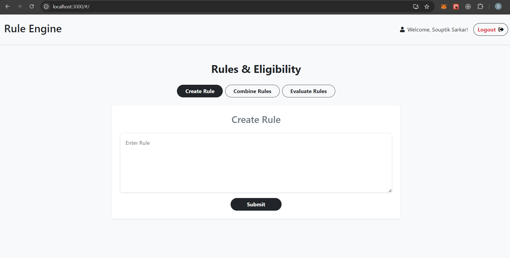

# Rule-Engine-with-AST

This project consists of a **Server** built with Express.js and MongoDB, and a **Client** built with React.js. The client and server communicate via API requests, with the server handling data and the client displaying it in the user interface.

## Table of Contents
- [Technologies Used](#technologies-used)
- [Prerequisites](#prerequisites)
- [Getting Started](#getting-started)
  - [Server Setup](#server-setup)
  - [Client Setup](#client-setup)
- [Available Scripts](#available-scripts)
  - [Server Scripts](#server-scripts)
  - [Client Scripts](#client-scripts)

## Technologies Used

### Server
- **Express**: Web framework for Node.js.
- **MongoDB**: NoSQL database for data storage.
- **Mongoose**: MongoDB ODM for schema-based data handling.
- **CORS**: Middleware to enable Cross-Origin Resource Sharing.
- **Multer**: Middleware for handling file uploads.
- **Body-Parser**: Middleware to parse incoming request bodies.
- **Cookie-Parser**: Middleware to parse cookies.

### Client
- **React.js**: JavaScript library for building user interfaces.
- **React Router DOM**: Handles routing in the React application.
- **Google API**: `gapi-script` and `react-google-login` for Google authentication.
- **SweetAlert**: Library for beautiful alerts.
- **Bootstrap**: CSS framework for styling.

## Prerequisites

You will need to have the following installed on your machine:
- Node.js
- npm (Node Package Manager)
- MongoDB

## Getting Started

Clone the repository:
   ```bash
git clone https://github.com/souptiksarkar893/Rule-Engine-with-AST.git
cd Rule-Engine-with-AST/server
```

### Server Setup
1. Navigate to the server directory:
   ```bash
   cd server
   ```

2. Install server dependencies:
   ```bash
   npm install
   ```

3. Create a `.env` file in the root of the `server` directory with necessary environment variables like `MONGO_URI` (MongoDB connection string) and other configurations.

4. Start the server:
   ```bash
   nodemon myserver.js
   ```

### Client Setup
1. Navigate to the client directory:
   ```bash
   cd ../client
   ```

2. Install client dependencies:
   ```bash
   npm install
   ```

3. Start the React development server:
   ```bash
   npm start
   ```

4. The client will run at `http://localhost:3000` and proxy API requests to the server running on `http://localhost:5000`.




## Available Scripts

### Server Scripts
- **`nodemon myserver.js`**: Starts the Express server.

### Client Scripts
- **`npm start`**: Starts the React development server.
- **`npm run build`**: Builds the React app for production.
- **`npm test`**: Runs the test suite.
- **`npm run eject`**: Ejects the React app's configuration.
